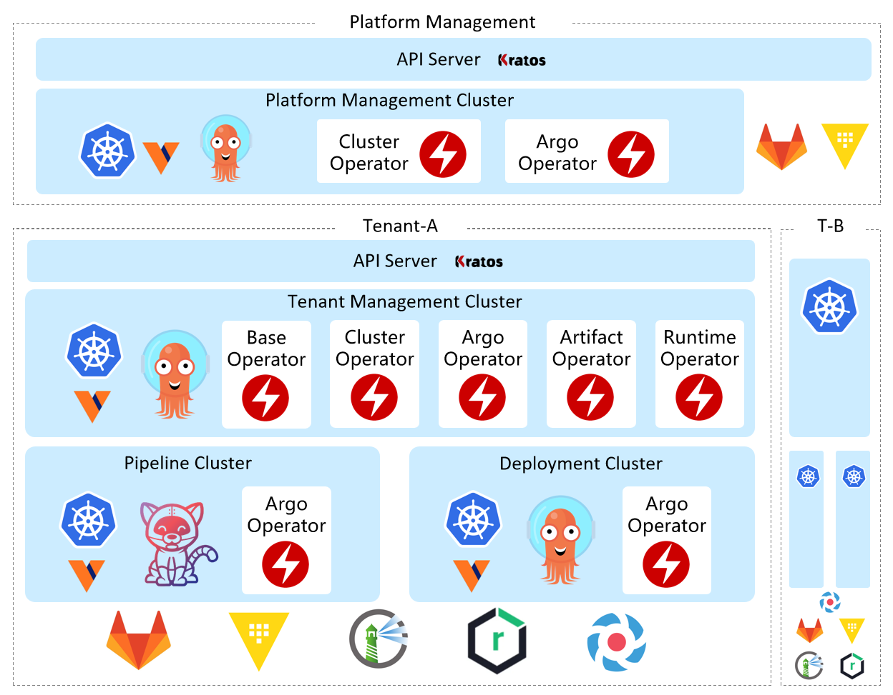

# 概述

Nautes 是 Kubernetes 原生的开源一站式开发者平台，融合了 DevOps 和 GitOps 的理念和最佳实践，以可插拔的方式集成了业界最优秀的云原生开源项目。

## 特性

- 覆盖敏捷开发、CI/CD、自动化测试、安全、运维等全流程的一站式开发者平台。
- 遵循 GitOps 最佳实践，以版本库作为唯一可信数据源。当版本库中的数据有变更时，由 Operator 自动识别变更并向 Kubernetes 集群做增量更新。
- 全分布式的多租户架构，租户作为分布式的计算单元和存储单元支持水平扩展，租户所管理的资源同样支持水平扩展。
- 良好的适配性，除了底座 Kubernetes 以及 Git 外，其他组件均可被替换。
- 所有功能均提供声明式的REST API，支持二次开发。
- 对所集成的开源项目，均保持其原生特性，无裁剪式封装，对受管应用不产生二次绑定。
- 通过构建上层数据模型，实现对所集成的开源项目的统一认证、统一授权。
- 支持私有云、混合云的部署模式。

## 架构

Nautes 采用全分布式的多租户架构，平台管理集群负责租户的分配和回收，每个租户独占一套资源（包括代码库、密钥库、制品库、认证服务器、集群等），租户内的资源由租户管理集群进行管理。

租户作为资源的管理单元，可由用户根据自身组织特性进行划分，常见的划分方式有：按产品团队、按部门、按子公司等。

租户内的资源也支持多实例部署，例如：可以在一个租户内部署多个 Harbor 实例，用于隔离不同产品的容器镜像数据。

## 实体定义

- **产品**：对应一个软件系统，包含团队、项目、环境、代码库、制品库、及运行时。产品可以被租户管理员授权使用指定的 Kubernetes 集群。
- **项目**：对应一个微服务，每个项目有自己的代码库。您可以使用集群进行项目的集成和部署，也可以使用产品的制品库对项目的制品进行存储和版本管理。 一个产品下可以包含多个项目。
- **环境**：使用集群（目前只支持 Kubernetes集群）来承载产品中各个项目的集成和部署的管理单元。一个产品包含多个环境，如：开发环境、测试环境、预生产环境和生产环境等。
- **代码库**：用于存储项目的源代码、流水线配置、部署清单的版本库。只支持 Git。
- **流水线运行时**：定义用于集成项目的流水线的配置声明，如：流水线配置的存储位置、流水线的触发方式、运行流水线的目标环境等。
- **部署运行时**：定义用于部署项目的配置声明，如：部署清单的存储位置、部署到的目标环境等。